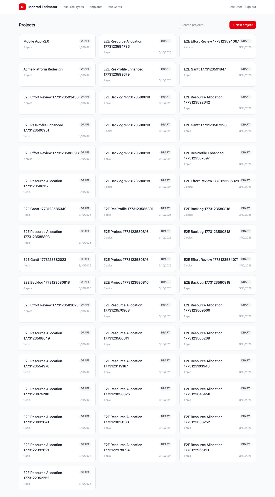
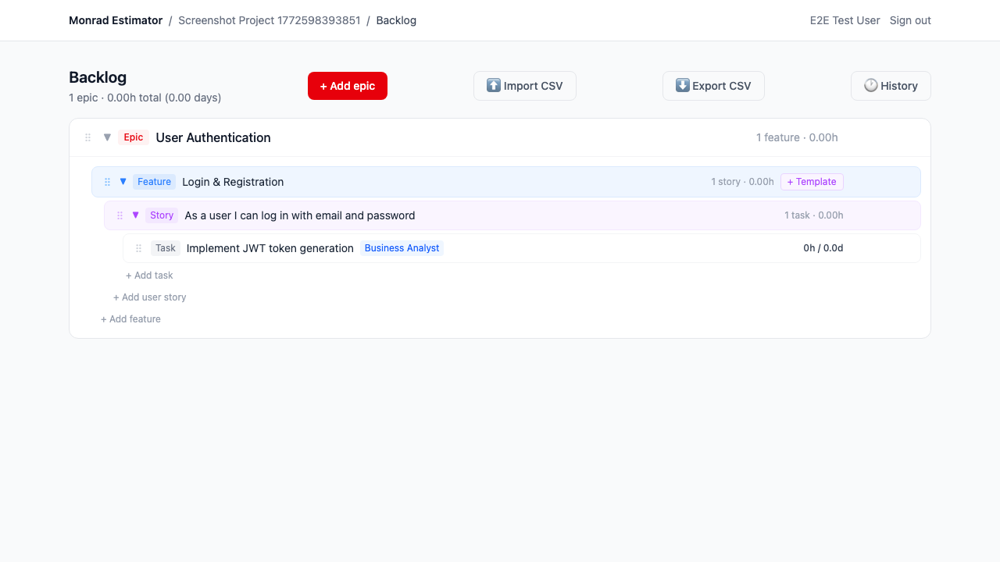
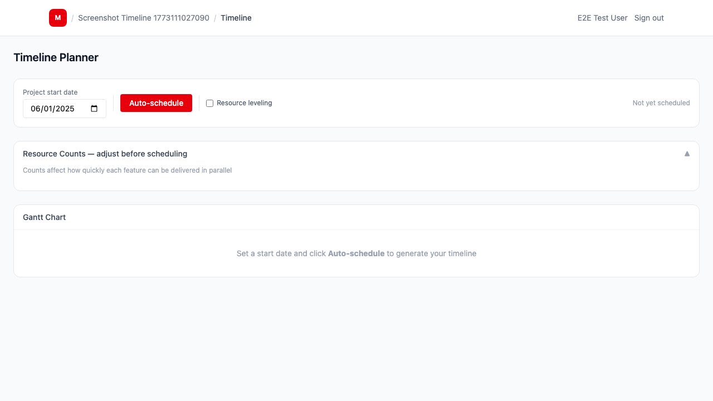
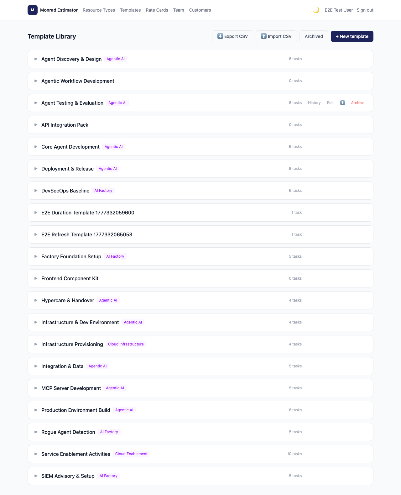
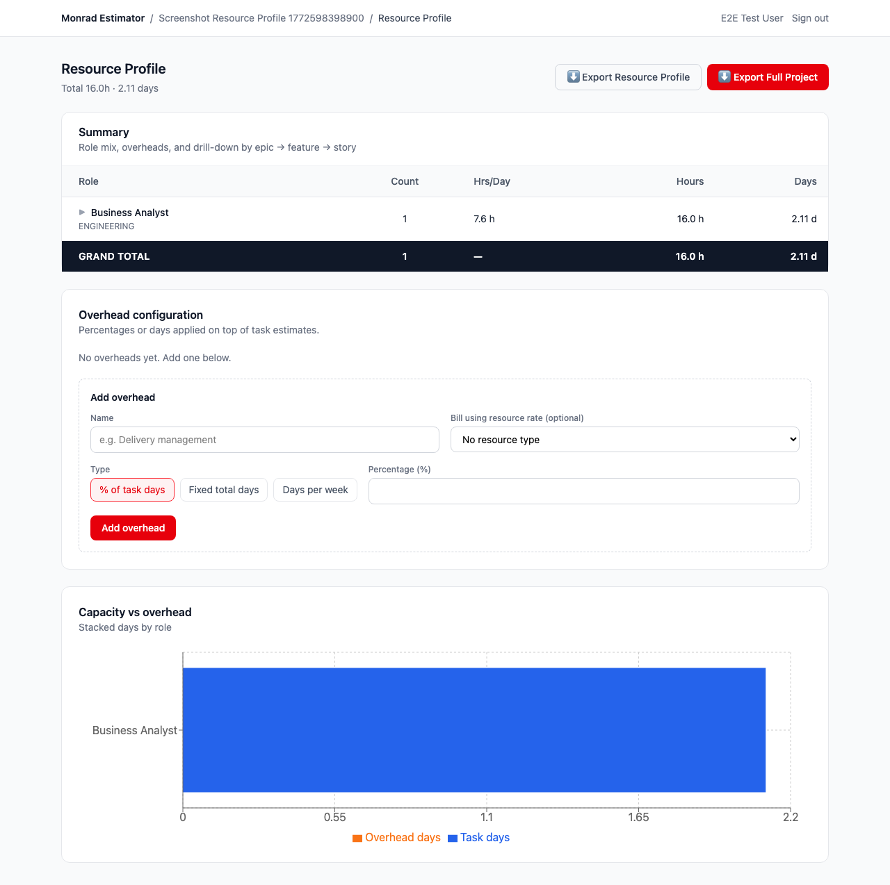
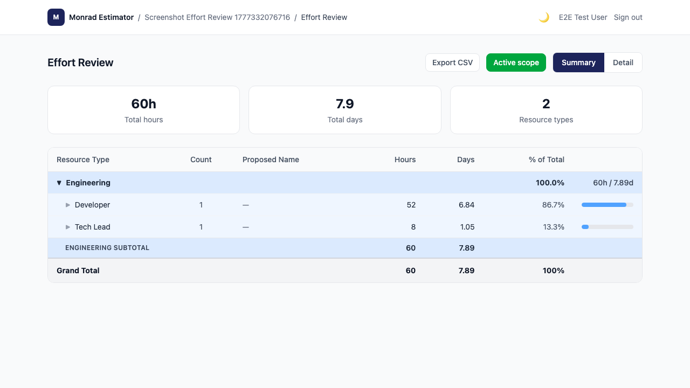

# Monrad Estimator

A full-stack project estimation tool that replaces a manual spreadsheet process. It produces scoped backlogs, effort summaries, resource profiles, timelines, and eventually SOW documents.

---

## Tech Stack

| Layer | Technology |
|---|---|
| Frontend | React + Vite + TypeScript + Tailwind CSS |
| Backend | Node.js + Express + TypeScript |
| ORM | Prisma 7 (driver adapter mode) |
| Database | PostgreSQL |
| Auth | JWT (Bearer token) |
| Testing | Vitest + Supertest (server), Vitest + React Testing Library (client), Playwright (E2E) |

---

## Project Structure

```
/client        React + Vite frontend
/server        Express + Prisma API
  /prisma      Schema + migrations
  /scripts     Utility scripts (e.g. e2e:cleanup)
/e2e           Playwright E2E tests
```

---

## Getting Started

### Prerequisites
- Node.js 20+
- Docker (recommended — easiest way to run PostgreSQL locally)

### 1. Start PostgreSQL

**With Docker (recommended):**
```bash
docker run -d \
  --name monrad-pg \
  -e POSTGRES_USER=postgres \
  -e POSTGRES_PASSWORD=postgres \
  -e POSTGRES_DB=monrad_estimator \
  -p 5432:5432 \
  postgres:15
```

**Without Docker (existing PostgreSQL install):** ensure a database named `monrad_estimator` exists and update `DATABASE_URL` in step 2 with your credentials.

### 2. Install dependencies

```bash
npm install          # installs root + all workspaces
```

### 3. Configure environment

```bash
cp server/.env.example server/.env
```

`server/.env.example` contains sensible defaults for local development. Edit it if your PostgreSQL credentials differ from the Docker command above.

#### Email / SMTP (optional)

Email is used for password reset links and org invite emails. Without SMTP configured, both flows still work — the email content and link are printed to the server console instead.

To enable real email delivery, add the following to `server/.env`:

```env
SMTP_HOST="smtp-relay.brevo.com"   # or your provider's SMTP host
SMTP_PORT="587"
SMTP_USER="your-smtp-login"
SMTP_PASS="your-smtp-key-or-password"
SMTP_FROM="Monrad Estimator <you@yourdomain.com>"
CLIENT_URL="http://localhost:5173"  # base URL used in email links
```

**Recommended free providers:**

| Provider | Free tier | Notes |
|---|---|---|
| [Brevo](https://brevo.com) | 300 emails/day | SMTP login = account email, password = generated SMTP key |
| [Resend](https://resend.com) | 3,000 emails/month | Requires a verified domain |
| [SendGrid](https://sendgrid.com) | 100 emails/day | Industry standard |

For **Brevo**: generate an SMTP key at *Settings → SMTP & API → SMTP*, then verify a sender address at *Senders & IPs → Add a sender*.

### 4. Run database migrations

```bash
cd server
npx prisma migrate deploy
npx prisma generate
```

### 5. Start development servers

```bash
npm run dev          # API on :3001 + Vite on :5173 (concurrently)
```

### Run tests

```bash
# Server unit/integration tests
cd server && npm test

# TypeScript check
cd server && npx tsc --noEmit
cd client && npx tsc --noEmit

# E2E (requires both dev servers running)
cd e2e && ./node_modules/.bin/playwright test --workers=1
```

---

## Phases & Progress

### ✅ Phase 1 — Foundation
Repo setup, Vite + React + TypeScript + Tailwind, Express + Prisma, DB schema, JWT auth, project CRUD.

### ✅ Phase 2 — Backlog Builder
Backlog hierarchy (Epic → Feature → Story → Task), tree view UI, manual entry, resource type management, bidirectional hours/days input. CSV export/import with 3-step staging workflow, upsert-by-hierarchy re-import, status columns (EpicStatus/FeatureStatus/StoryStatus), and Template link on stories.

### ✅ Phase 3 — Template Library
Feature Template data model + API, Template Library UI, template-based backlog generation (select template + complexity → creates tasks). Globally unique template names enforced. Templates linkable to stories via CSV import/export.

### ✅ Phase 4 — Effort Review
Effort summary API grouped by resource type and epic. Summary view with expandable epic sub-rows, cost columns (day rate + estimated cost, conditional on rate data), and category subtotals. Detail view with Excel-like column filters (Epic, Feature, Story, Resource Type dropdowns + task name text search), cascading filter dropdowns, cost per task, and totals rows. Active-scope toggle to focus on in-scope items only.

### ✅ Phase 5 — Timeline Planner
Timeline data model + API with dependency-aware auto-scheduler, proportional pool resource levelling, and fractional-week durations. SVG Gantt chart with feature and story bars, drag-and-drop manual scheduling with override indicators, inter-feature dependency arrows, sequential/parallel epic mode toggle, resource demand histogram, custom feature colours (colour picker saved to `Feature.timelineColour`), over-allocation indicators (red dot on Gantt bars in over-allocated weeks), and onboarding/buffer zone visualisation (amber onboarding zone at chart start, indigo buffer zone at chart end). Inline edit panel for start week, duration, and feature dependencies. CSV export (Gantt + resource demand + named resources) and full-width PNG export (dark-mode aware).

### ✅ Phase 6 — Resource Profile
Per-resource hours/days/cost aggregation with epic → feature → story drill-down, configurable overhead items (% of task days, fixed total days, days per week × project duration), stacked bar chart, FTE calculation, dual CSV exports (resource profile + full project zip). Per-resource `hoursPerDay` and `dayRate` overrides support multi-locale teams (e.g. AU 7.6h vs NZ 8h). Onboarding/buffer weeks panel: onboarding weeks allocated to Full Project and Overhead resources before delivery begins; buffer weeks appended at project end. Allocation mode-aware named resource bars on Timeline (FULL_PROJECT spans full project; TIMELINE uses derived or manual range; T&M shows demand bars). Cost Summary Period column shows mode-correct date ranges. See [#6](https://github.com/NickMonrad/monrad-estimator/issues/6).

### 🚧 Phase 7 — Document Generation *(in progress)*
Scope document and Statement of Work as PDF + Word (.docx), configurable branding and section toggles. Phase 7a (programmatic PDF scope document) shipped in [#129](https://github.com/NickMonrad/monrad-estimator/pull/129). See [#7](https://github.com/NickMonrad/monrad-estimator/issues/7).

### 🚧 Phase 8 — Cost Basis & Rate Cards *(partially started)*
Day rates per resource type (global defaults + project overrides) and cost columns in Effort Review are shipped. Remaining: per-resource-type discounts, project-level discounts (value/duration/manual), cost summary UI, cost section in SOW. See [#8](https://github.com/NickMonrad/monrad-estimator/issues/8).

### 🚧 Phase 9 — AI Backlog Generator *(not started)*
"Generate from brief" using OpenAI or Claude, AI-suggested templates at appropriate complexity. See [#9](https://github.com/NickMonrad/monrad-estimator/issues/9).

---

## Screenshots

| Projects | Backlog |
|---|---|
|  |  |

| Timeline | Templates |
|---|---|
|  |  |

| Resource Profile | Effort Review |
|---|---|
|  |  |

> Screenshots are auto-generated by running `npm run screenshots` from the repo root.

---

## Shipped Enhancements (post-phase)

| Enhancement | PR |
|---|---|
| Global resource type catalog + project instances | #27 |
| Configurable hours/day per project + project settings | #20 |
| Resource type propagation + referential integrity | #32 |
| Backlog UX — auto-expand after creation | #31 |
| Template task reorder, refresh from template, backlog version history | #36 |
| Backlog CSV export/import with 3-step staging workflow | #37 |
| Backlog drag-and-drop reorder (all levels + cross-parent moves) | #40 |
| XS (extra small) complexity level | #40 |
| DurationDays auto-calculated from hoursEffort across all creation paths | #40 |
| Nullable resource type on tasks (CSV import resilience) | #51 |
| Per-resource hoursPerDay + dayRate; snapshot rollback perf | #54 |
| Phase 6: Resource Profile — FTE, overhead, cost, chart, CSV exports | #55 |
| README Phase 6 status + resource-profile screenshot | #63 |
| Phase 7 CI pipeline, timeline dependency scheduler, resource levelling, fractional weeks | #95 |
| Deactivate epics/features/stories to mark as out of scope | #100 |
| SVG Gantt overhaul: story bars, drag-and-drop, dependency arrows, proportional pool scheduler, resource histogram, clear-all-overrides, tooltip enhancements | #106 |
| Backlog CSV export removes complexity-tier columns (HoursXS–XL); import retains backwards compat | #107 |
| Backlog CSV redesign: Type column, per-level status (EpicStatus/FeatureStatus/StoryStatus), Template link on stories, upsert-by-hierarchy import, unique template names, export filename includes client/project/date, DurationDays precision fix | #110 |
| Resource Profile: fix inherited global day rates not applied to cost calculation | #111 |
| Effort Review: active-scope filter toggle, cost columns (day rate + total), expandable epic sub-rows in summary, Excel-like column filters in detail view, cost + totals in detail | #112 |
| Effort Review enhancements — cost columns, active filter, epic breakdown, detail column filters | #113 |
| Resource Profile & Commercial overhaul — named resources, rate cards, discounts, GST | #118 |
| Remove Westpac branding references | #120 |
| Effort Review CSV export (summary + detail, respects active filter and hasCost flag) | #120 |
| Fix new project resource type seeding (was hardcoded, now uses live global catalog) | #122 |
| Project-level resource type management screen — add/remove/override rates per project | #122 |
| Fix CSV import 413 payload-too-large error on large backlogs | #127 |
| Per-named-resource allocation modes (Full Project / Timeline / Custom) + Commercial tab overhaul | #131 |
| Resource period start/end dates, buffer weeks indicators, commercial double-count fix, allocation label fix, CSV epic/feature descriptions + assumptions, Epic.assumptions field, document assumptions section, LAB3 colour scheme, PDF heading fixes | #132 |
| PDF cover page: generated-by username, generation time, document label, projected end date; backlog CSV fix for epic/feature descriptions; commercial tab removes aggregate row; auto-create person on resource type creation; assumptions exclude out-of-scope items | #135 |
| Comprehensive dark mode theming across all pages and components; standardised headers with M icon, ThemeToggle, and breadcrumb nav on all global and project pages; SVG dark mode (Gantt, histogram, named resources) via `useIsDark` hook; epic/feature/story colour hierarchy in dark mode | #143 |
| Document generator: normalise customer data for PDF rendering, harden cover-page layout, and replace fragile scope summary table layout with long-content-safe rendering | #155 |
| Timeline & Resource Profile enhancements — person-first model, over-allocation indicators, custom feature colours, onboarding/buffer zones, PNG/CSV export, allocation mode-aware named resources | #164 |
| Doc Generator v2 — Puppeteer server-side PDF, TipTap rich text editor (all description/assumptions fields), Overview section in scope doc, timezone-aware timestamps on document label and filename | #166 |

---

## Open Issues & Backlog

### 🐛 Bugs
| # | Title |
|---|---|
| [#67](https://github.com/NickMonrad/monrad-estimator/issues/67) | Investigate and fix two flaky Playwright tests (backlog.spec.ts) |

### 🔧 Near-term enhancements
| # | Title |
|---|---|
| [#150](https://github.com/NickMonrad/monrad-estimator/issues/150) | Resource Profile: warn when project resources have no rates applied |
| [#108](https://github.com/NickMonrad/monrad-estimator/issues/108) | docs: comprehensive functional specification (`docs/FUNCTIONAL_SPEC.md`) |
| [#109](https://github.com/NickMonrad/monrad-estimator/issues/109) | Global Customer entity (name, description, account code, CRM link) + link to projects |
| [#57](https://github.com/NickMonrad/monrad-estimator/issues/57) | Template tasks: assumptions + description fields |
| [#61](https://github.com/NickMonrad/monrad-estimator/issues/61) | Template tasks: percentage-based tasks (% of cumulative totals) |
| [#56](https://github.com/NickMonrad/monrad-estimator/issues/56) | Clone project |
| [#64](https://github.com/NickMonrad/monrad-estimator/issues/64) | Global configuration menu (resource types, templates, overhead defaults) |
| [#23](https://github.com/NickMonrad/monrad-estimator/issues/23) | Global default overheads, inheritable per project |
| [#46](https://github.com/NickMonrad/monrad-estimator/issues/46) | Soft-delete templates with restore |
| [#62](https://github.com/NickMonrad/monrad-estimator/issues/62) | Refactor: flatMap in effort.ts + snapshots.ts |
| [#19](https://github.com/NickMonrad/monrad-estimator/issues/19) | Apply template button — improve discoverability |
| [#69](https://github.com/NickMonrad/monrad-estimator/issues/69) | GST configurable rate per project via Project Settings (ex-GST/inc-GST totals already ship in Resource Profile; rate UI missing) |

### 🚀 Feature ideas
| # | Title |
|---|---|
| [#35](https://github.com/NickMonrad/monrad-estimator/issues/35) | Backlog version history — diff UI and compare view (snapshots + rollback already shipped) |
| [#70](https://github.com/NickMonrad/monrad-estimator/issues/70) | Locale and currency settings (default AU/AUD) |
| [#71](https://github.com/NickMonrad/monrad-estimator/issues/71) | Public holiday calendars for resource/cost modelling by locale |
| [#72](https://github.com/NickMonrad/monrad-estimator/issues/72) | Timezone setting per account (default AEST) |
| [#73](https://github.com/NickMonrad/monrad-estimator/issues/73) | Project financial tracking — upload actuals CSV, project over/under-spend |
| [#74](https://github.com/NickMonrad/monrad-estimator/issues/74) | Terms of use page + required acceptance checkbox at signup |
| [#75](https://github.com/NickMonrad/monrad-estimator/issues/75) | Support contact form + footer links (FAQ, How-to) |
| [#76](https://github.com/NickMonrad/monrad-estimator/issues/76) | Export backlog to Azure DevOps Boards |
| [#24](https://github.com/NickMonrad/monrad-estimator/issues/24) | Per-resource overhead configuration |
| [#22](https://github.com/NickMonrad/monrad-estimator/issues/22) | Project sharing / multi-user collaboration |
| [#10](https://github.com/NickMonrad/monrad-estimator/issues/10) | Password reset flow |
| [#114](https://github.com/NickMonrad/monrad-estimator/issues/114) | Cross-project dashboard with summary analytics |


### 🏭 Productionisation
| # | Title |
|---|---|
| [#77](https://github.com/NickMonrad/monrad-estimator/issues/77) | Productionisation tracking issue |
| [#78](https://github.com/NickMonrad/monrad-estimator/issues/78) | Security review — application code |
| [#79](https://github.com/NickMonrad/monrad-estimator/issues/79) | Azure architecture design (non-prod + prod) |
| [#80](https://github.com/NickMonrad/monrad-estimator/issues/80) | Infrastructure as code (Bicep or Terraform) |
| [#81](https://github.com/NickMonrad/monrad-estimator/issues/81) | Security review — infrastructure design |
| [#82](https://github.com/NickMonrad/monrad-estimator/issues/82) | Deployment pipeline — infrastructure |
| [#83](https://github.com/NickMonrad/monrad-estimator/issues/83) | CI pipeline on main branch merge |
| [#84](https://github.com/NickMonrad/monrad-estimator/issues/84) | Branching strategy / GitOps approach |
| [#85](https://github.com/NickMonrad/monrad-estimator/issues/85) | Deployment pipeline — application code |
| [#86](https://github.com/NickMonrad/monrad-estimator/issues/86) | Penetration testing |
| [#87](https://github.com/NickMonrad/monrad-estimator/issues/87) | Resiliency, availability, and scalability |
| [#88](https://github.com/NickMonrad/monrad-estimator/issues/88) | Alerting and monitoring |
| [#89](https://github.com/NickMonrad/monrad-estimator/issues/89) | Entra ID / OIDC authentication provider |

### 🎉 Fun
| # | Title |
|---|---|
| [#34](https://github.com/NickMonrad/monrad-estimator/issues/34) | Geocities theme |
| [#90](https://github.com/NickMonrad/monrad-estimator/issues/90) | Use issues backlog as screenshot test data |
| [#91](https://github.com/NickMonrad/monrad-estimator/issues/91) | Custom profile picture upload |

---

## E2E Tests

Playwright tests are documented in [`e2e/TESTS.md`](e2e/TESTS.md). See [`CONTRIBUTING.md`](CONTRIBUTING.md) for how to run them and what's required before raising a PR.

---

## Contributing

See [`CONTRIBUTING.md`](CONTRIBUTING.md) for branching strategy, PR process, commit message format, and testing standards.
